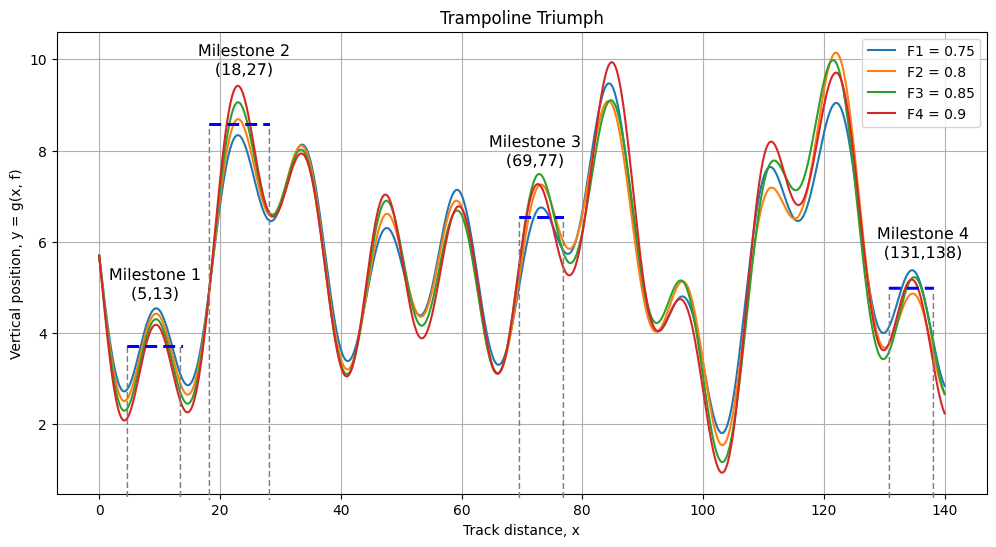

# Problem Statement
The director of the Summer Games is a fan of jumping games, so he invented a new game this year- Trampoline Triumph. In this game, the players jump nonstop on a series of trampolines in a straight line that form a track. As he likes jumping high, he designed the goal of the game to be not to finish the track the fastest, but to jump the highest at certain milestones spread throughout the track. There are $M$ milestones on the track, and each milestone $i$ has start and end positions $(L_i, R_i)$ that define the horizontal range of the milestone. Each of the $N$ players $P_j$ participating in this game has an individual performance factor $F_j$. When a player $P_j$ moves through the horizontal range $(L_i, R_i)$ of the milestone $i$, if their maximum jump distance $J_{ij}$ in this range is higher than all other players' maximum jump distances, they score a point for that milestone, otherwise, they score zero points for that milestone. At the end, the player with the highest score wins.

Fortunately, the paths of all players closely resemble the following function and vary only slightly depending on the players' performance factors. The vertical position of a player $P_j$ with the performance factor $f = F_j$ can be calculated at position $x$ as,   
$g(x, f) = \left[ 6-2 \cdot f \cdot \sin(\frac{x}{2})-2 \cdot f \cdot \sin(\frac{x}{5})-2 \cdot f \cdot \sin(\frac{x}{7}) \right] \times \left[ 0.9+\frac{1+\sin \left( \frac{x \cdot f}{3} \right)  }{20} \right]$

[Click here to view the function g(x, 0.80) on Desmos Graphing Calculator](https://www.desmos.com/calculator/u4hqvji9py)

```
# Here's the code-friendly version of the function:
g(x, f) = (6 - 2 * f * sin(x / 2) - 2 * f * sin(x / 5) - 2 * f * sin(x / 7)) * (0.9 + (1 + sin(x * f / 3)) / 20)
```

It is guaranteed that each milestone has a unique winner, i.e., there will be no ties for the highest maximum jump distance. It is also guaranteed that the milestone start and end positions are always placed around the usual highest jump point in a particular area. More formally, it is guaranteed that for each milestone, there's only one local maxima between the coordinates $(L_i, R_i)$ for each player. Hint: Why is this constraint needed?



The director needs your help to calculate the final scores of each player. Print a leaderboard sorted in descending order by score.


# Input
The first line contains the number of players $N$, a positive integer.  
The second line contains $N$ space-separated numbers denoting the individual performance factors $F_j$.  
The third line contains the number of milestones $M$, a positive integer.  
Each of the following $M$ lines contain two space-separated numbers that define a milestone, $(L_i, R_i)$.  

```
<N>
<F_1> <F_2> ... <F_N>
<M>
<L_1> <R_1>
<L_2> <R_2>
...
<L_M> <R_M>
```

# Constraints
- $2 \leq N \leq 10$
- $0.75 \leq F_j \leq 1$
- $2 \leq M \leq 10^4$
- $1 \leq L_i < R_i \leq 10^4$
- $1 \leq R_i - L_i \leq 15$
- $F_j, L_i, R_i$ are all floating-point numbers and have up to four decimal places.
- The vertical position of a player $P_j$ with the performance factor $F_j$ can be calculated at position $x$ using the function $f(x, F_j)$ given above.
- It is guaranteed that each milestone has a unique winner, i.e., there will be no ties for the highest maximum jump distance.
- It is guaranteed that the milestone start and end positions are always placed around the usual highest jump point in that area. More formally, it is guaranteed that for each milestone, there's only one local maxima between the coordinates $(L_i, R_i)$ for each player. Hint: Why is this constraint needed?
- The local maxima should be precise up to $10^{-9}$ to ensure accurate results. Hint: Use double-precision floating-point numbers for calculations.
- Output the player numbers using 1-based indexing.

# Output
Sort the scores in descending order, breaking ties such that the player with the lower player number is printed first. Print two space-separated integers for each player on a new line, the player number $j$ (1-based indexing) and the score.
 
```
<Player number> <First highest score>
<Player number> <Second highest score>
...
<Player number> <Lowest score>
```

# Examples
The first 3 test cases are examples.
